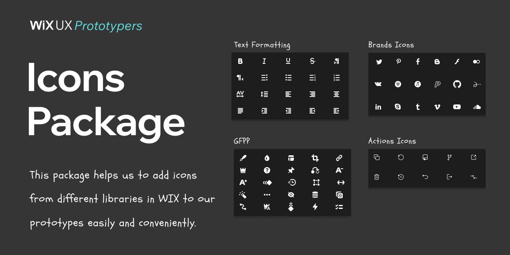

    🚀&nbsp;
    <a target="_blank" href="https://www.prototype-land.com">
   	 Go to all prototypes
   </a>
   
   <h1 class="main-heading"> {{  titleParts[0] | capitalize }} // {{ titleParts[1] | capitalize }} {{ titleParts[2] | capitalize }}</h1>
   

      

         <h4 class="links-heading">Prototype Links
         </h4>
         <ol>
            
            <li>
               <a
                  target="_blank"
                  href="{{ variation.url }}"
                  >
               {{ variation.name }}
               </a>
               

                  {{ variation.description }}
               

            </li>
            
         </ol>
         

            

            <h4 class="project-description-heading">Project Description</h4>
            
{{ site.description }}

            
UX Owner : {{site.ux_owner}}

            
Prototyper : {{site.prototyper}}

            
Date Created : {{site.date_created}}

            <h4 >Useful Links</h4>
            
            <a target="_blank"
               href="{{ link.url }}">{{link.name}}</a>
            
         

      

      

         

            
         

      

   

